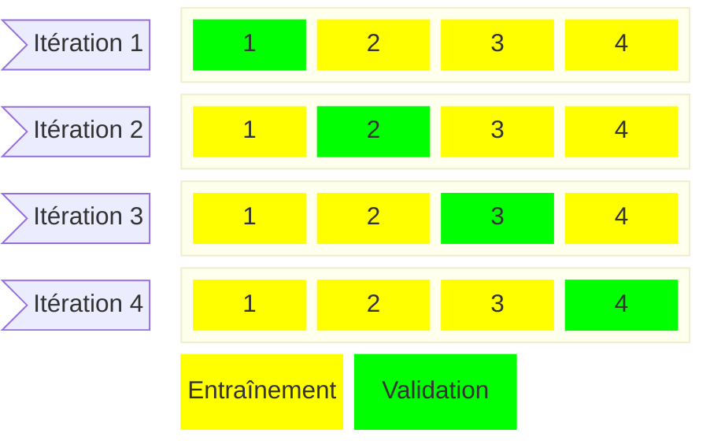

```mermaid
block-beta
    columns 4

    classDef Class_validation stroke:#0F0, fill:#0F0, color:#000
    classDef Class_entrainement stroke:#FF0, fill:#FF0, color:#111

    Iteration1>"Itération 1"]

    block:S1:3
        columns 4
         11["1"] 12["2"] 13["3"] 14["4"]
        class 11 Class_validation
        class 12,13,14 Class_entrainement
    end
  
    Iteration2>"Itération 2"]

    block:S2:3
        columns 4
        21["1"] 22["2"] 23["3"] 24["4"]
        class 22 Class_validation
        class 21,23,24 Class_entrainement
    end

    Iteration3>"Itération 3"]

    block:S3:3
        columns 4
        31["1"] 32["2"] 33["3"] 34["4"]
        class 33 Class_validation
        class 31,32,34 Class_entrainement
    end

    Iteration4>"Itération 4"]

    block:S4:3
        columns 4
        41["1"] 42["2"] 43["3"] 44["4"]
        class 44 Class_validation
        class 41,42,43 Class_entrainement
    end

    space Entrainement["Entraînement"] Validation["Validation"] space
    
    class Entrainement Class_entrainement
    class Validation Class_validation
```