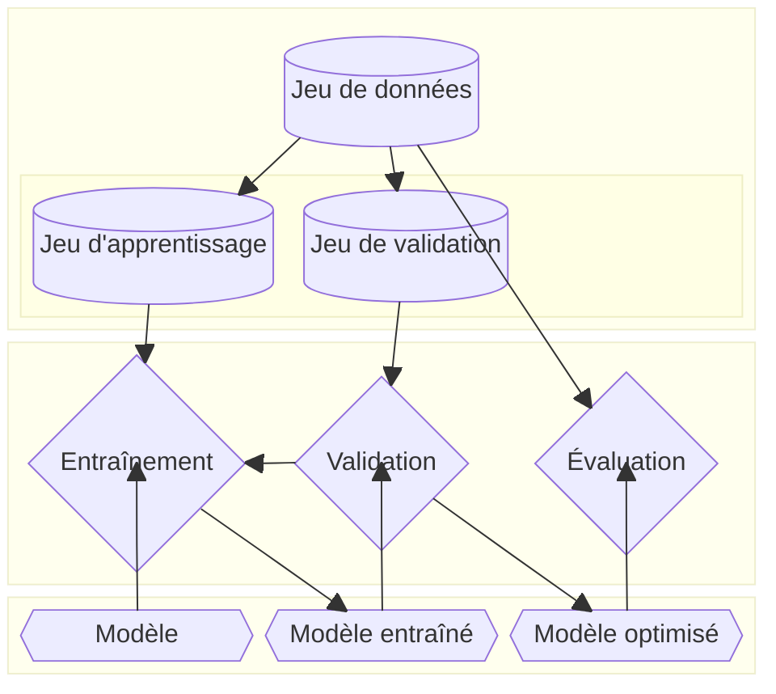

```mermaid
block-beta
columns 3
    block:Donnees:3
        columns 1
        Jeu[("Jeu de données")]

        block:DonneesDiv
            columns 2
            Jeu -->  JeuApprentissage[("Jeu d'apprentissage")]
            Jeu --> JeuValidation[("Jeu de validation")]
        end
    end
    

    block:Traitement:3
        Entrainement{"Entraînement"}
        Validation{"Validation"}
        Evaluation{"Évaluation"}
    end

    block:Modeles:3
        Modele{{"Modèle"}} 
        ModeleEntraine{{"Modèle entraîné"}}
        ModeleOptimise{{"Modèle optimisé"}}
    end

    Modele --> Entrainement
    JeuApprentissage --> Entrainement

    Entrainement --> ModeleEntraine

    ModeleEntraine --> Validation
    JeuValidation --> Validation 

    Validation --> Entrainement

    Validation --> ModeleOptimise

    Jeu --> Evaluation
    ModeleOptimise --> Evaluation
```